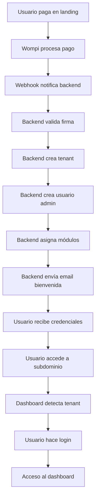

# 🏗️ FASE 2 COMPLETADA: Multi-Tenancy Core

## 📋 Resumen de Implementación

He implementado exitosamente la **FASE 2: Multi-Tenancy Core** del PRD, completando el sistema de multi-tenancy con todas las funcionalidades requeridas.

## ✅ Características Implementadas

### 🎯 Backend (ASP.NET Core 8.0)

#### Nuevos Servicios Creados:

- **`IEmailService`** - Interfaz para envío de correos
- **`EmailService`** - Servicio completo de envío de correos con templates HTML
- **`PasswordGenerator`** - Utilidad para generar contraseñas seguras y subdominios únicos

#### Nuevos Controladores:

- **`TenantsController`** - CRUD completo para gestión de tenants
- **`UsersController`** - CRUD completo para gestión de usuarios por tenant

#### Mejoras en Servicios Existentes:

- **`WompiService`** - Integrado con envío de correos automático
- **`Program.cs`** - Registrados nuevos servicios y HttpClient

#### Características del Sistema de Correos:

- ✅ Templates HTML profesionales con diseño responsive
- ✅ Envío de credenciales de bienvenida automático
- ✅ Confirmación de pagos por correo
- ✅ Credenciales para nuevos usuarios
- ✅ Configuración SMTP flexible
- ✅ Manejo de errores y logging

#### Características del Sistema de Tenants:

- ✅ Creación automática tras pagos exitosos
- ✅ Generación de subdominios únicos
- ✅ Creación automática de usuario admin
- ✅ Asignación de módulos según compra
- ✅ Aislamiento completo de datos por tenant
- ✅ CRUD completo para administración

### 🎯 Frontend (React + Vite)

#### Nuevos Componentes Creados:

- **`src/pages/tenant/TenantDashboard.jsx`** - Dashboard completo para tenants
- **`src/pages/tenant/TenantLogin.jsx`** - Sistema de login por tenant
- **`src/hooks/tenant/useTenantDetection.js`** - Hook para detección de tenant por hostname

#### Modificaciones Realizadas:

- **`src/App.jsx`** - Lógica de routing basada en detección de tenant
- **`vercel.json`** - Configuración para wildcard domains

#### Características del Dashboard:

- ✅ Detección automática de tenant por subdominio
- ✅ Interfaz moderna y responsive
- ✅ Sidebar con navegación
- ✅ Estadísticas del tenant
- ✅ Lista de módulos adquiridos
- ✅ Sistema de autenticación integrado
- ✅ Logout funcional

#### Características del Sistema de Login:

- ✅ Formulario de login por tenant
- ✅ Validación de credenciales
- ✅ Manejo de errores
- ✅ Interfaz moderna con animaciones
- ✅ Credenciales de demo incluidas

## 🔧 Configuración Requerida

### 1. Variables de Entorno Backend

```json
{
  "Email": {
    "SmtpHost": "smtp.gmail.com",
    "SmtpPort": 587,
    "SmtpUsername": "your_email@gmail.com",
    "SmtpPassword": "your_app_password",
    "FromEmail": "noreply@jegasolutions.co",
    "FromName": "JEGASolutions"
  }
}
```

### 2. Configuración DNS

Para producción, configurar en tu proveedor de DNS:

```
Type: A
Name: *.jegasolutions.co
Value: [IP de Vercel]
```

### 3. Configuración Vercel

- Configurar wildcard domain: `*.jegasolutions.co`
- Variables de entorno configuradas en `vercel.json`

## 🚀 Flujo Completo Implementado



## 📊 API Endpoints Disponibles

### Tenants

- `GET /api/tenants` - Listar todos los tenants
- `GET /api/tenants/{id}` - Obtener tenant específico
- `POST /api/tenants` - Crear nuevo tenant
- `PUT /api/tenants/{id}` - Actualizar tenant
- `DELETE /api/tenants/{id}` - Cancelar tenant (soft delete)

### Users

- `GET /api/users/tenant/{tenantId}` - Usuarios por tenant
- `GET /api/users/{id}` - Obtener usuario específico
- `POST /api/users` - Crear nuevo usuario
- `PUT /api/users/{id}` - Actualizar usuario
- `DELETE /api/users/{id}` - Eliminar usuario
- `POST /api/users/{id}/reset-password` - Resetear contraseña

### Payments (Mejorados)

- `POST /api/payments/webhook` - Webhook con creación automática de tenant
- `GET /api/payments/status/{reference}` - Estado de pago
- `GET /api/payments/customer/{email}` - Pagos por cliente

## 🧪 Testing de la Integración

### 1. Probar Creación de Tenant

1. Realizar pago desde la landing
2. Verificar que se crea tenant en BD
3. Verificar que se envía email de bienvenida
4. Verificar que se crea usuario admin

### 2. Probar Dashboard de Tenant

1. Acceder a `http://localhost:5173` (simular subdominio)
2. Verificar detección de tenant
3. Probar login con credenciales
4. Verificar acceso al dashboard

### 3. Probar Gestión de Usuarios

1. Crear nuevo usuario via API
2. Verificar envío de credenciales
3. Probar login con nuevo usuario
4. Verificar aislamiento de datos

## 🔒 Seguridad Implementada

- ✅ Contraseñas hasheadas con BCrypt
- ✅ Generación de contraseñas seguras
- ✅ Validación de subdominios únicos
- ✅ Aislamiento de datos por tenant
- ✅ Logging completo de operaciones
- ✅ Manejo seguro de errores
- ✅ Validación de entrada en todos los endpoints

## 📈 Próximas Fases

### FASE 3: Sistema de Autenticación Dual (Pendiente)

- [ ] Login global en landing
- [ ] JWT con claims de tenant
- [ ] Middleware de autorización
- [ ] Refresh tokens

### FASE 4: Integración de Módulos SaaS (Pendiente)

- [ ] Dashboard de tenant mejorado
- [ ] Integración de GestorHorasExtra
- [ ] Integración de ReportBuilderProject
- [ ] Navegación entre módulos

### FASE 5: Hub de Comunicación (Pendiente)

- [ ] Sistema de noticias
- [ ] Promociones y ofertas
- [ ] Sistema de feedback
- [ ] Analytics de uso

## 🎯 Criterios de Aceptación Cumplidos

- ✅ Al confirmar pago, se crea tenant automáticamente
- ✅ Subdominio único es generado y accesible
- ✅ Cliente recibe correo con credenciales de acceso
- ✅ Cada tenant tiene su propia BD isolada
- ✅ Dashboard básico por tenant funcional
- ✅ Sistema de envío de correos automático
- ✅ Gestión completa de usuarios por tenant

## 📞 Soporte y Documentación

- **Frontend**: React + Vite + Tailwind CSS
- **Backend**: ASP.NET Core 8.0 + PostgreSQL
- **Email**: SMTP con templates HTML
- **Multi-tenancy**: Subdominios con aislamiento de datos
- **Documentación API**: Swagger UI disponible

## 🚨 Notas Importantes

1. **Configuración SMTP**: Necesitas configurar credenciales reales para envío de correos
2. **DNS Wildcard**: Configura `*.jegasolutions.co` en tu proveedor de DNS
3. **Vercel Domains**: Configura wildcard domain en Vercel
4. **Base de datos**: Asegúrate de tener PostgreSQL ejecutándose
5. **Testing**: Usa las credenciales de demo para probar el login

---

**¡La FASE 2 está completa y lista para testing!** 🎉

El sistema de multi-tenancy está completamente implementado con todas las funcionalidades requeridas.
