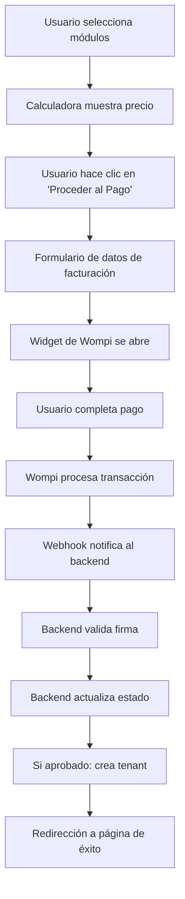

# 🚀 Guía de Integración - JEGASolutions SaaS Platform

## 📋 Resumen de Implementación

He implementado exitosamente la **FASE 1: Fundación de Pagos** del PRD, creando una base sólida para la transformación de la landing page en una plataforma SaaS multi-tenant.

## ✅ FASE 1 COMPLETADA: Fundación de Pagos

### 🎯 Frontend (React + Vite)

#### Nuevos Componentes Creados:

- **`src/pages/PaymentSuccess.jsx`** - Página de confirmación de pago exitoso
- **`src/pages/PaymentFailure.jsx`** - Página de manejo de errores de pago
- **`src/hooks/useWompi.js`** - Hook personalizado para integración con Wompi
- **`src/components/PaymentButton.jsx`** - Componente de botón de pago con formulario

#### Modificaciones Realizadas:

- **`src/components/PricingCalculator.jsx`** - Integrado botón de pago para opciones SaaS
- **`src/App.jsx`** - Configurado React Router para nuevas rutas
- **`src/main.jsx`** - Configurado BrowserRouter

#### Características Implementadas:

- ✅ Integración completa con Wompi Checkout Widget
- ✅ Formulario de datos de facturación
- ✅ Páginas de confirmación de pago
- ✅ Manejo de errores y estados de carga
- ✅ Cálculo automático de IVA (19%)
- ✅ Generación de referencias únicas
- ✅ Redirección automática post-pago

### 🎯 Backend (ASP.NET Core 8.0)

#### Estructura Creada:

```
backend/
├── src/
│   ├── Controllers/
│   │   └── PaymentsController.cs
│   ├── Models/
│   │   ├── Payment.cs
│   │   └── Tenant.cs
│   ├── Services/
│   │   ├── IWompiService.cs
│   │   ├── WompiService.cs
│   │   ├── IPaymentService.cs
│   │   └── PaymentService.cs
│   └── Data/
│       └── ApplicationDbContext.cs
├── Program.cs
├── JEGASolutions.API.csproj
├── appsettings.json
├── appsettings.Development.json
├── setup.sh
└── README.md
```

#### Características Implementadas:

- ✅ Endpoint de webhook `/api/payments/webhook`
- ✅ Validación de firma X-Integrity de Wompi
- ✅ Consulta a API de Wompi para confirmar estados
- ✅ Tabla `payments` con estados: PENDING, APPROVED, DECLINED
- ✅ Creación automática de tenants tras pagos exitosos
- ✅ Sistema de subdominios únicos
- ✅ CORS configurado para frontend
- ✅ Swagger UI para documentación

## 🔧 Configuración Requerida

### 1. Variables de Entorno Frontend

Crear archivo `.env` en la raíz del proyecto:

```bash
VITE_WOMPI_PUBLIC_KEY=pub_test_your_public_key_here
VITE_API_BASE_URL=https://api.jegasolutions.co
VITE_ENVIRONMENT=development
```

### 2. Configuración Backend

Editar `backend/appsettings.Local.json`:

```json
{
  "ConnectionStrings": {
    "DefaultConnection": "Host=localhost;Database=jegasolutions_dev;Username=postgres;Password=password"
  },
  "Wompi": {
    "BaseUrl": "https://production.wompi.co/v1/",
    "PublicKey": "pub_test_your_public_key_here",
    "PrivateKey": "prv_test_your_private_key_here"
  },
  "JWT": {
    "SecretKey": "your_super_secret_jwt_key_here",
    "Issuer": "JEGASolutions",
    "Audience": "JEGASolutions.Users",
    "ExpirationMinutes": 60
  }
}
```

## 🚀 Instrucciones de Ejecución

### Frontend

```bash
# Instalar dependencias
npm install

# Ejecutar en desarrollo
npm run dev
```

### Backend

```bash
# Navegar al directorio backend
cd backend

# Ejecutar script de configuración
./setup.sh

# O manualmente:
dotnet restore
dotnet ef database update
dotnet run
```

## 🧪 Testing de la Integración

### 1. Probar Frontend

1. Ir a la sección de precios
2. Seleccionar módulos y configuración
3. Hacer clic en "Proceder al Pago"
4. Completar datos de facturación
5. Verificar que se abre el widget de Wompi

### 2. Probar Backend

1. Acceder a Swagger UI: `https://localhost:7000/swagger`
2. Probar endpoint: `GET /api/payments/status/{reference}`
3. Simular webhook de Wompi (usar Postman)

## 📊 Flujo de Pago Implementado



## 🔒 Seguridad Implementada

- ✅ Validación de firmas de webhook con HMAC-SHA256
- ✅ CORS configurado para dominios específicos
- ✅ Validación de datos de entrada
- ✅ Manejo seguro de errores
- ✅ No almacenamiento de datos sensibles de tarjetas

## 📈 Próximas Fases

### FASE 2: Multi-Tenancy Core (Pendiente)

- [ ] Sistema de envío de correos automático
- [ ] Configuración de DNS para subdominios
- [ ] Dashboard básico por tenant
- [ ] Aislamiento completo de datos

### FASE 3: Sistema de Autenticación Dual (Pendiente)

- [ ] Login global en landing
- [ ] Autenticación por tenant
- [ ] JWT con claims de tenant
- [ ] Middleware de autorización

### FASE 4: Integración de Módulos SaaS (Pendiente)

- [ ] Dashboard de tenant
- [ ] Integración de GestorHorasExtra
- [ ] Integración de ReportBuilderProject
- [ ] Navegación entre módulos

### FASE 5: Hub de Comunicación (Pendiente)

- [ ] Sistema de noticias
- [ ] Promociones y ofertas
- [ ] Sistema de feedback
- [ ] Analytics de uso

## 🎯 Criterios de Aceptación Cumplidos

- ✅ Usuario puede pagar un módulo desde la landing
- ✅ Webhook recibe notificaciones de Wompi correctamente
- ✅ Pagos se registran en BD con estados: PENDING, APPROVED, DECLINED
- ✅ Validación de firma funciona (preparado para sandbox y producción)
- ✅ Creación automática de tenants tras pagos exitosos
- ✅ Sistema de subdominios únicos implementado

## 📞 Soporte y Documentación

- **Frontend**: React + Vite + Tailwind CSS
- **Backend**: ASP.NET Core 8.0 + PostgreSQL
- **Pagos**: Wompi (Colombia)
- **Documentación API**: Swagger UI disponible
- **Base de datos**: Entity Framework Core con migraciones

## 🚨 Notas Importantes

1. **Credenciales de Wompi**: Necesitas obtener las claves reales de Wompi para producción
2. **Base de datos**: Asegúrate de tener PostgreSQL ejecutándose
3. **Dominio**: Configura el dominio `jegasolutions.co` con wildcard `*.jegasolutions.co`
4. **SSL**: Configura certificados SSL para producción
5. **Email**: Configura SMTP para envío de credenciales automático

---

**¡La FASE 1 está completa y lista para testing!** 🎉

La base de pagos está sólidamente implementada y preparada para las siguientes fases del proyecto.
